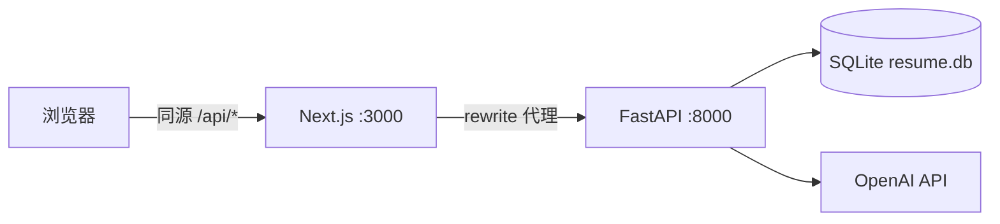

# Smart Resume

AI 驱动的智能简历助手：上传 PDF 简历，自动结构化解析，在线编辑、STAR 法则润色、HR 视角诊断评分，并导出 ATS 友好的 PDF。

## 功能概览

| 模块 | 能力 |
|------|------|
| **上传与解析** | 拖拽/点击上传 PDF，pdfplumber 提取文本，OpenAI 结构化为 JSON |
| **可视化编辑** | 飞书文档风格表单，支持教育/工作/项目的增删改，手动保存 |
| **AI 润色** | 基于 STAR 法则优化工作与项目描述，量化成果与专业表达 |
| **AI 诊断** | 严苛 HR 总监视角打分（0–100），输出亮点、不足与优化建议 |
| **预览导出** | A4 单栏 ATS 友好排版，浏览器一键「另存为 PDF」 |

未配置 `OPENAI_API_KEY` 或 LLM 调用失败时，后端自动返回结构化 Mock 数据，前端始终可正常演示。

## 技术栈

| 层级 | 技术 |
|------|------|
| 前端 | Next.js 16 (App Router)、React 19、Tailwind CSS 4 |
| 后端 | FastAPI、SQLAlchemy、SQLite、pdfplumber、OpenAI SDK |
| AI | `gpt-4o-mini`，JSON mode |
| 部署 | Docker Compose、Nginx、PM2（Ubuntu 裸机） |

## 架构



**生产环境**：前端通过 Next.js `rewrites` 将 `/api/*` 代理到后端，浏览器只访问单一域名，无跨域问题。SQLite 文件通过 `DB_DIR` 挂载到持久化卷（Docker `./data` 或裸机 `data/`）。

## 用户流程

1. 首页上传 PDF → 自动 `POST /api/upload` + `POST /api/parse/{id}`
2. 跳转 `/editor/{id}` 编辑简历内容
3. 可选：💾 保存修改 · ✨ AI 润色 · 📊 AI 诊断 · 📄 预览导出 PDF

## 项目结构

```
smart-resume-app/
├── frontend/                 # Next.js 前端
│   └── src/
│       ├── app/              # 首页、编辑器路由
│       ├── components/       # Toast、ResumePreview、AutoTextarea 等
│       ├── lib/api.ts        # 同源 /api 请求封装
│       └── types/resume.ts   # 简历与诊断 JSON 类型
├── backend/                  # FastAPI 后端
│   ├── main.py               # 路由与生命周期
│   ├── llm_service.py        # 解析 / 润色 / 诊断 + Mock 兜底
│   ├── models.py             # Resume 单表模型
│   ├── database.py           # SQLite（支持 DB_DIR）
│   └── API.md                # REST API 详细文档
├── devops/                   # 生产部署
│   ├── docker-compose.yml
│   ├── backend/Dockerfile
│   ├── frontend/Dockerfile
│   ├── setup_vm.sh           # Ubuntu 一键环境安装
│   ├── nginx.conf            # 80 端口反向代理
│   └── ecosystem.config.js   # PM2 进程配置
├── data/                     # 持久化数据库目录（部署时使用）
└── docker-compose.yml        # 引用 devops/docker-compose.yml
```

## 本地开发

### 环境要求

- Python 3.11+
- Node.js 20+
- （可选）OpenAI API Key

### 1. 后端

```bash
cd backend
python -m venv venv
source venv/bin/activate          # Windows: venv\Scripts\activate
pip install -r requirements.txt
cp .env.example .env              # 填入 OPENAI_API_KEY（可留空使用 Mock）
python run.py
```

后端：`http://localhost:8000` · 交互文档：`http://localhost:8000/docs`

### 2. 前端

```bash
cd frontend
npm install
npm run dev
```

前端：`http://localhost:3000`

开发模式下，Next.js 将 `/api/*` 自动代理到 `http://127.0.0.1:8000`（见 `frontend/next.config.ts`），无需单独配置 CORS。

## 环境变量

| 变量 | 位置 | 说明 |
|------|------|------|
| `OPENAI_API_KEY` | `backend/.env` 或根目录 `.env` | OpenAI 密钥；缺失时使用 Mock |
| `DB_DIR` | 后端进程 | SQLite 目录，默认 `backend/`；生产建议 `./data` |
| `BACKEND_URL` | 前端进程 | Next.js 代理目标，如 `http://backend:8000`（Docker 内网） |

## API 摘要

完整说明见 [`backend/API.md`](backend/API.md)。

| Method | Path | 说明 |
|--------|------|------|
| GET | `/api/health` | 健康检查 |
| POST | `/api/upload` | 上传 PDF，提取文本入库 |
| POST | `/api/parse/{id}` | LLM 结构化解析 → `parsed_data` |
| GET | `/api/resume/{id}` | 获取简历全字段（含 `analysis_data`） |
| PUT | `/api/resume/{id}` | 保存前端编辑的 JSON → `parsed_data` |
| POST | `/api/optimize/{id}` | STAR 润色（Body 传当前 JSON） |
| POST | `/api/analyze/{id}` | AI 诊断评分（Body 传当前 JSON） |

### 简历 JSON 结构

`parsed_data` / `optimized_data` 共享以下顶层字段：

- `basic_info` — name, email, phone, location, summary
- `education[]` — school, degree, start_date, end_date, description
- `experience[]` — company, title, dates, description, projects[]
- `skills[]` — 字符串数组

`analysis_data`：`score`, `strengths[]`, `weaknesses[]`, `suggestions[]`

## 生产部署

### 方式一：Docker Compose（推荐）

```bash
# 项目根目录
cp backend/.env.example .env    # 或 cp backend/.env .env
docker compose up --build -d
```

- 访问：`http://localhost`（80 → 3000）
- 数据库持久化：`./data/resume.db`
- 编排文件：`devops/docker-compose.yml`

### 方式二：Ubuntu 裸机

```bash
bash devops/setup_vm.sh

sudo cp devops/nginx.conf /etc/nginx/sites-available/smart-resume
sudo ln -sf /etc/nginx/sites-available/smart-resume /etc/nginx/sites-enabled/
sudo nginx -t && sudo systemctl reload nginx

cd devops && pm2 start ecosystem.config.js
pm2 save && pm2 startup
```

- Nginx 监听 80，`client_max_body_size 20M`
- `/api/` → FastAPI 8000，`/` → Next.js 3000
- PM2 守护 `resume-backend` 与 `resume-frontend`

## 设计原则

- **单表 SQLite**，按简历 UUID 关联，无用户登录
- **LLM 必带 try-except**，失败返回固定 Mock，保证前端可渲染
- **代码极简**，避免过度抽象
- 详见 [`.cursor/rules/project-global-standards.mdc`](.cursor/rules/project-global-standards.mdc)

## 变更记录

见 [`CHANGELOG`](CHANGELOG)。
